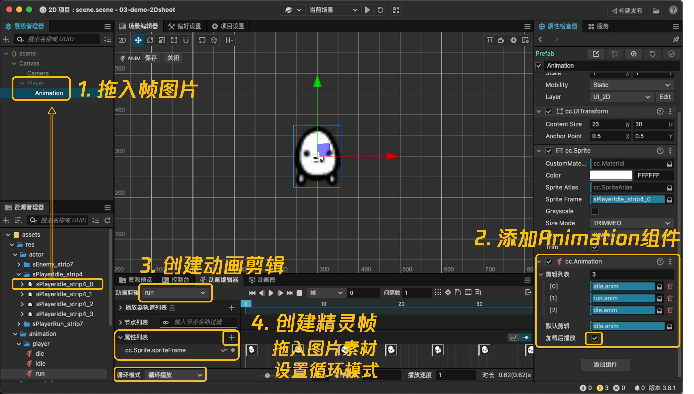
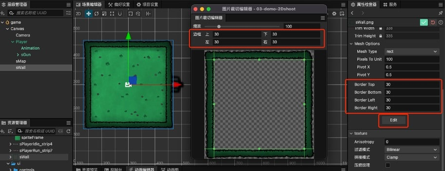
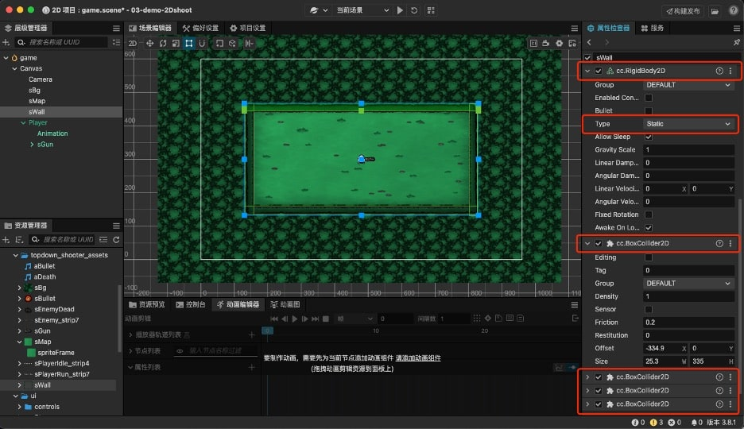
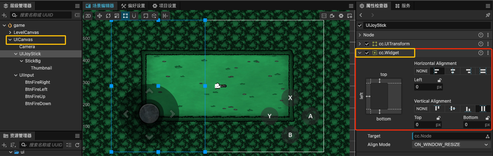
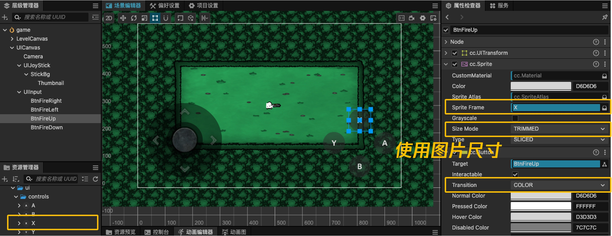

# cocos入门之2D 射击小游戏开发

> 视频教程地址: https://space.bilibili.com/5981196/channel/collectiondetail?sid=1257703

## 1. 项目设置

功能剪裁，仅勾选需要的功能，缩小包体积

## 2. 制作角色帧动画

## 3. 场景绘制

### 3.1 九宫格制作

对图片资源编辑，处理九宫格参数。

修改场景中的图片精灵类型，Sprite Type 有以下4种：

+ **Simple**: 缩放到目标大小，图片整张全显示，不裁切，不叠加，有拉伸

+ **Slice**: 切片，九宫格，4边拉伸

+ **Tiled**: 平铺，支持九宫格，4边和中间平铺

+ **Filled**: 填充，指定区域显示，水平、垂直、圆周

九宫格按需选择 Slice 或 Tiled。

### 3.2 背景图平铺

Sprite Type 选择 Tiled 瓦片平铺。

### 3.3 空气墙

围栏精灵添加 RigidBody2D 刚体，同时添加 4 个 BoxCollider2D 碰撞体组件作为空气墙。

> 和3D不同，2D中的静态刚体也需要添加刚体组件

## 4. UI绘制

### 4.1 widget组件适配

不同层级的UI绘制在不同 Canvas 节点上，方便多人协作和后期分开优化。

创建 Canvas 节点，添加虚拟摇杆，UIJoyStick节点区域占据屏幕左半部分，便于用户操作，使用 widget 组件对尺寸位置进行适配，左侧固定距离0，垂直拉伸。

### 4.2 图片按钮

4个按键，创建2D button，替换图片素材，设置 Size Mode 为 Trimmed，按钮尺寸和图片尺寸一致，设置 transition 按下的变化为 color。

### 4.3 面板防穿透

创建 UIFail 结算面板，添加 `BlockInputEvents` 组件防止穿透到下层，添加 widget 组件水平垂直拉伸充满屏幕。

